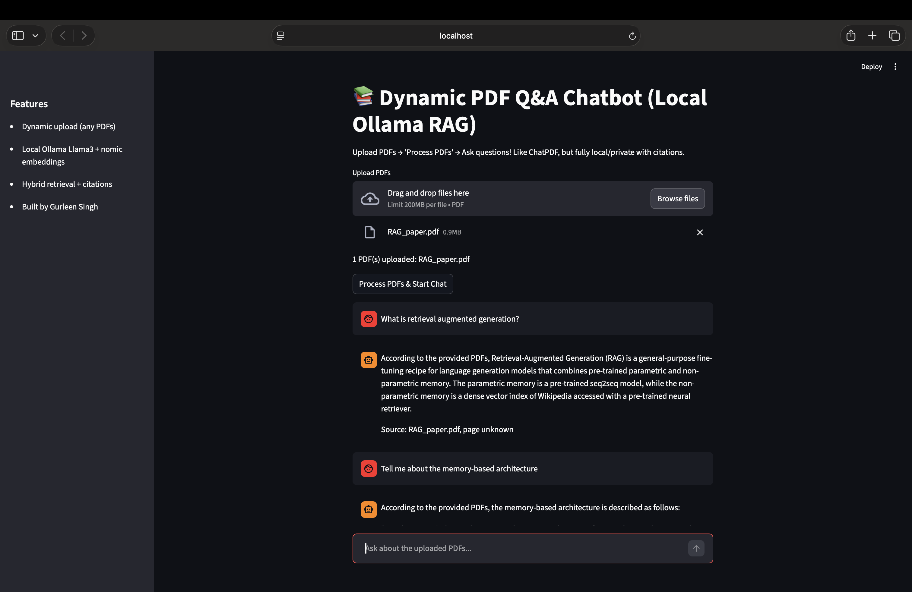
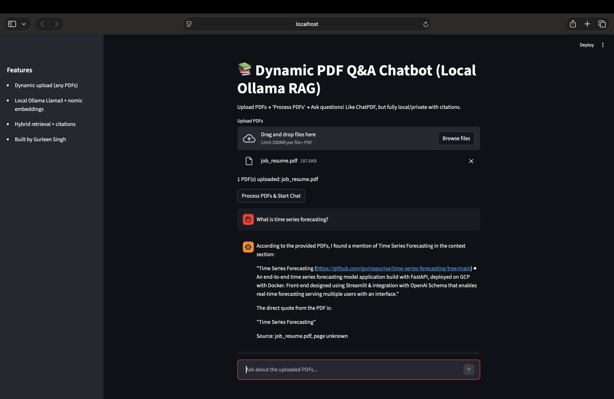
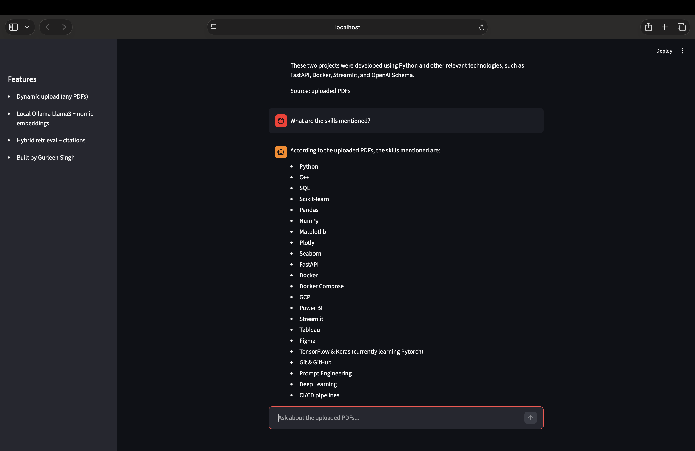

# 🤖 Dynamic PDF Q&A Chatbot with Local RAG

**End-to-end Retrieval-Augmented Generation app for chatting with any PDFs** — upload documents, process, and ask questions. Fully local (Ollama Llama3 + nomic embeddings), private, accurate with source citations. Like ChatPDF, but no cloud, no limits, no hallucinations.

Built by **Gurleen Singh** — AI Student at Durham College | Portfolio Project 2026

## 🚀 Features
- **Dynamic Upload**: Upload any PDFs (resumes, research papers, reports) — instant processing.
- **Local Ollama**: Runs Llama3-8B + nomic embeddings on your machine (private, fast, no API costs).
- **Hybrid Retrieval**: Semantic (nomic) + keyword (BM25) for reliable factual answers (GPA, projects, definitions).
- **Source Citations**: Grounded responses with filename + page references.
- **Unstructured Extraction**: Handles formatted/layout PDFs (tables, bold, resumes).
- **Modern Streamlit UI**: Clean chat bubbles, progress, example queries, model settings.
- **Hallucinations Guardrails**: Responds "I don't know" when info isn't in PDFs.


Upload my resume + AI papers for a personalized demo:
- Ask "What is Gurleen's GPA?" → "Current GPA: 4.88/5.0"
- "Deepfake project?" → Hybrid CNN-LSTM + InceptionV3 details
- "Time Series Forecasting?" → FastAPI + Docker + GCP + Streamlit
- "What is retrieval-augmented generation?" → Direct quote from original paper

## 📸 Screenshots





## 🛠 Tech Stack
- **Frontend**: Streamlit (dynamic UI, file upload)
- **RAG Pipeline**: LangChain, Chroma vector DB
- **Embeddings**: Ollama nomic-embed-text
- **LLM**: Ollama Llama3-8B (local)
- **PDF Extraction**: Unstructured (handles formatted resumes/papers)
- **Retrieval**: Hybrid (semantic + BM25)
- **Deployment**: Google Cloud Platform (Compute Engine)

## 🔧 Quick Setup & Run Locally
1. Pull Ollama models:
   ```bash
   ollama pull llama3
   ollama pull nomic-embed-text